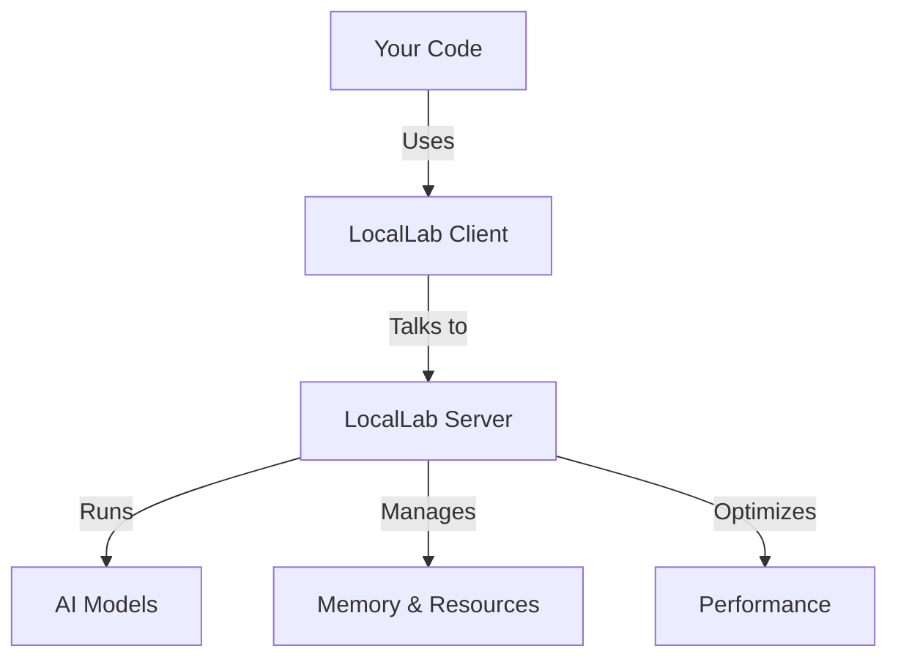

# 🚀 LocalLab: Your Personal AI Lab

Run powerful AI language models on your own computer or Google Colab - no cloud services needed! Think of it as having ChatGPT-like capabilities right on your machine.

## 🤔 What is LocalLab?

LocalLab brings AI to your fingertips with two key components:



### 🎯 Key Features

```
📦 Easy Setup         🔒 Privacy First       🎮 Free GPU Access
🤖 Multiple Models    💾 Memory Efficient    🔄 Auto-Optimization
🌐 Local or Colab    ⚡ Fast Response       🔧 Simple API
```

### 🌟 Two Ways to Run

1. **On Your Computer (Local Mode)**
   ```
   💻 Your Computer
   └── 🚀 LocalLab Server
       └── 🤖 AI Model
           └── 🔧 Auto-optimization
   ```

2. **On Google Colab (Free GPU Mode)**
   ```
   ☁️ Google Colab
   └── 🎮 Free GPU
       └── 🚀 LocalLab Server
           └── 🤖 AI Model
               └── ⚡ GPU Acceleration
   ```

## 📦 Installation & Setup

### Windows Setup
1. **Install Required Build Tools**
   - Install [Microsoft C++ Build Tools](https://visualstudio.microsoft.com/visual-cpp-build-tools/)
     - Select "Desktop development with C++"
   - Install [CMake](https://cmake.org/download/)
     - Add to PATH during installation

2. **Install Packages**
   ```powershell
   pip install locallab locallab-client
   ```

3. **Verify PATH**
   - If `locallab` command isn't found, add Python Scripts to PATH:
     ```powershell
     # Find Python location
     where python
     # Add Scripts folder to PATH (e.g., C:\Users\YOU\AppData\Local\Programs\Python\Python311\Scripts\)
     ```
   - Or use: `python -m locallab start`

> 🔍 Having issues? See our [Windows Troubleshooting Guide](./docs/guides/troubleshooting.md#windows-specific-issues)

### Linux/Mac Setup
```bash
# Install both server and client packages
pip install locallab locallab-client
```

### 2. Configure the Server (Recommended)

```bash
# Run interactive configuration
locallab config

# This will help you set up:
# - Model selection
# - Memory optimizations
# - GPU settings
# - System resources
```

### 3. Start the Server

```bash
# Start with saved configuration
locallab start

# Or start with specific options
locallab start --model microsoft/phi-2 --quantize --quantize-type int8
```


## 💡 Basic Usage

### Synchronous Usage (Easier for Beginners)

```python
from locallab_client import SyncLocalLabClient

# Connect to server
client = SyncLocalLabClient("http://localhost:8000")

try:
    print("Generating text...")
    # Generate text
    response = client.generate("Write a story")
    print(response)

    print("Streaming responses...")
    # Stream responses
    for token in client.stream_generate("Tell me a story"):
       print(token, end="", flush=True)

    print("Chat responses...")
    # Chat with AI
    response = client.chat([
        {"role": "system", "content": "You are helpful."},
        {"role": "user", "content": "Hello!"}
    ])
    print(response.choices[0]["message"]["content"])

finally:
    # Always close the client
    client.close()
```

### Asynchronous Usage (For Advanced Users)

```python
import asyncio
from locallab_client import LocalLabClient

async def main():
    # Connect to server
    client = LocalLabClient("http://localhost:8000")
    
    try:
        print("Generating text...")
        # Generate text
        response = await client.generate("Write a story")
        print(response)

        print("Streaming responses...")
        # Stream responses
        async for token in client.stream_generate("Tell me a story"):
            print(token, end="", flush=True)

        print("\nChatting with AI...")
        # Chat with AI
        response = await client.chat([
            {"role": "system", "content": "You are helpful."},
            {"role": "user", "content": "Hello!"}
        ])
        # Extracting Content
        content = response['choices'][0]['message']['content']
        print(content)
    finally:
        # Always close the client
        await client.close()

# Run the async function
asyncio.run(main())
```

## 🌐 Google Colab Usage

Run LocalLab on Google's free GPUs:

```python
# 1. Install packages
!pip install locallab locallab-client

# 2. Configure with CLI (notice the ! prefix)
!locallab config

# 3. Start server with CLI
!locallab start --use-ngrok

# 4. Connect client (Locally)
from locallab_client import LocalLabClient
client = LocalLabClient("https://your-server-ngrok-url.app")
response = await client.generate("Hello!")
```

## 💻 Requirements

### Local Computer
- Python 3.8+
- 4GB RAM minimum (8GB+ recommended)
- GPU optional but recommended
- Internet connection for downloading models

### Google Colab
- Just a Google account!
- Free tier works fine

## 🌟 Features

- **Easy Setup**: Just pip install and run
- **Multiple Models**: Use any Hugging Face model
- **Resource Efficient**: Automatic optimization
- **Privacy First**: All local, no data sent to cloud
- **Free GPU**: Google Colab integration
- **Flexible Client API**: Both async and sync clients available
- **Automatic Resource Management**: Sessions close automatically

[➡️ See All Features](./docs/features/README.md)

## 📚 Documentation

### Getting Started
1. [Installation Guide](./docs/guides/getting-started.md)
2. [Basic Examples](./docs/guides/examples.md)
3. [CLI Usage](./docs/guides/cli.md)

### Advanced Topics
1. [API Reference](./docs/guides/api.md)
2. [Client Libraries](./docs/clients/README.md)
3. [Advanced Features](./docs/guides/advanced.md)
4. [Performance Guide](./docs/features/performance.md)

### Deployment
1. [Local Setup](./docs/deployment/local.md)
2. [Google Colab Guide](./docs/colab/README.md)

## 🔍 Need Help?

- Check [FAQ](./docs/guides/faq.md)
- Visit [Troubleshooting](./docs/guides/troubleshooting.md)
- Ask in [Discussions](https://github.com/UtkarshTheDev/LocalLab/discussions)

## 📖 Additional Resources

- [Contributing Guide](./docs/guides/contributing.md)
- [Changelog](./CHANGELOG.md)
- [License](./LICENSE)

## 🌟 Star Us!
If you find LocalLab helpful, please star our repository! It helps others discover the project.

---

Made with ❤️ by Utkarsh Tiwari
[GitHub](https://github.com/UtkarshTheDev) • [Twitter](https://twitter.com/UtkarshTheDev) • [LinkedIn](https://linkedin.com/in/utkarshthedev)
