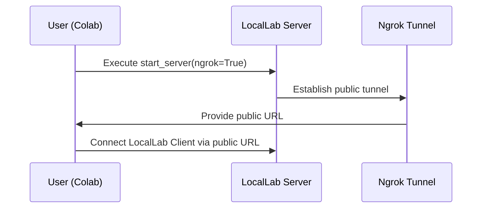
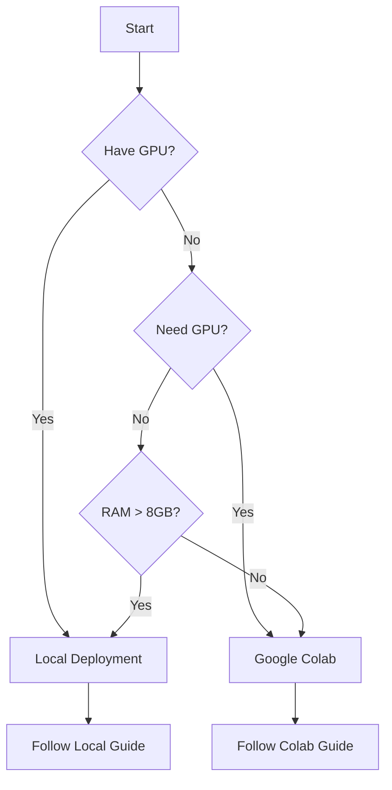
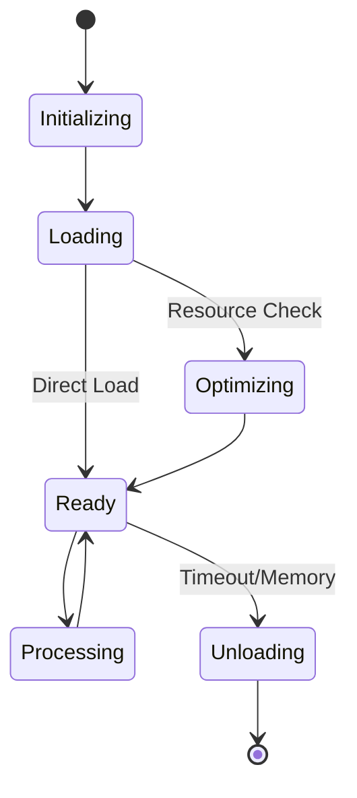

# 🚀 LocalLab Documentation

Welcome to the LocalLab documentation! This guide is your one-stop resource for everything you need to get started, deploy, and maximize the capabilities of LocalLab.

## Overview

LocalLab empowers you to run AI inference servers either locally or through Google Colab. With advanced model management, performance optimizations, and robust system monitoring, LocalLab is built to deliver efficient, on-demand AI capabilities.

## Visual Overview

### Architecture Diagram

This diagram illustrates the overall architecture of LocalLab:

```mermaid
graph TD
    A[User] --> B[LocalLab Client (Python/Node.js)]
    B --> C[LocalLab Server]
    C --> D[Model Manager]
    D --> E[Hugging Face Models]
    C --> F[Optimizations]
    C --> G[Resource Monitoring]
```

### Google Colab Workflow

When using Google Colab, LocalLab leverages ngrok to provide public access:



## 📚 Documentation Structure

```
docs/
├── guides/           # Start here for comprehensive guides
│   ├── getting-started.md  # Begin your journey
│   ├── api.md             # API documentation
│   ├── faq.md            # Common questions
│   ├── troubleshooting.md # Solve common issues
│   ├── advanced.md       # Advanced usage
│   └── contributing.md   # Contribution guidelines
│
├── clients/          # Client library documentation
│   ├── python/      # Python client guide
│   ├── nodejs/      # Node.js client guide
│   └── comparison.md # Compare client features
│
├── deployment/       # Deployment guides
│   ├── local.md     # Local deployment
│   └── production.md # Production setup
│
├── colab/           # Google Colab integration
│   └── guide.ipynb  # Interactive notebook
│
└── features/        # Feature documentation
    ├── models.md    # Model management
    └── performance.md # Performance guide
```

## 🚀 Quick Navigation

### For New Users
1. Start with our [Getting Started Guide](./guides/getting-started.md)
2. Choose your client: [Python](./clients/python/README.md) or [Node.js](./clients/nodejs/README.md)
3. Pick your deployment: [Local](./deployment/local.md) or [Google Colab](./colab/README.md)

### Deployment Decision Guide



### Model Loading States


## 📖 How to Read This Documentation

1. **New Users**
   - Start with [Getting Started](./guides/getting-started.md)
   - Check [FAQ](./guides/faq.md) for common questions
   - Use [Troubleshooting](./guides/troubleshooting.md) when stuck

2. **Developers**
   - Review [API Reference](./guides/api.md)
   - Choose your [Client Library](./clients/README.md)
   - Follow [Deployment Guide](./deployment/README.md)

3. **Advanced Users**
   - Explore [Advanced Features](./guides/advanced.md)
   - Learn about [Performance](./features/performance.md)
   - Consider [Contributing](./guides/contributing.md)

## 🔍 Finding Help

- Use the navigation above to find specific topics
- Check [FAQ](./guides/faq.md) for quick answers
- Visit [Troubleshooting](./guides/troubleshooting.md) for common issues
- Open an [Issue](https://github.com/Developer-Utkarsh/LocalLab/issues) for support

## 🌟 Features

- **Multiple Model Support:** Pre-configured models and custom model loading
- **Advanced Optimizations:** Quantization, attention slicing, and more
- **Resource Management:** Automatic monitoring and optimization
- **Flexible Deployment:** Local or Google Colab options
- **Client Libraries:** Python and Node.js support

## 📚 Additional Resources

- [GitHub Repository](https://github.com/Developer-Utkarsh/LocalLab)
- [Community Forum](https://github.com/Developer-Utkarsh/LocalLab/discussions)
- [Contributing Guidelines](./guides/contributing.md)

---

This documentation is designed to help you quickly navigate LocalLab's features—from installation and basic usage to advanced optimization and troubleshooting. Choose your path from the navigation above and enjoy exploring LocalLab!
