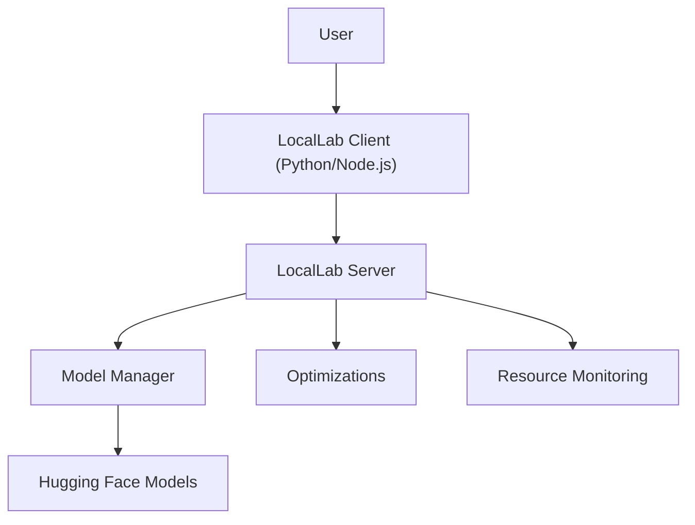

```mermaid
graph TD;
    A["User"] --> B["LocalLab Client (Python/Node.js)"];
    B --> C["LocalLab Server"];
    C --> D["Model Manager"];
    D --> E["Hugging Face Models"];
    C --> F["Optimizations"];
    C --> G["Resource Monitoring"];
```
