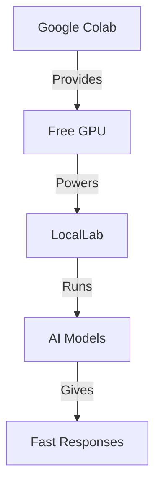

# 🎮 Using LocalLab with Google Colab

Run powerful AI models for free using Google Colab's GPU! This guide will help you get started.

## 🚀 Quick Start

[](https://colab.research.google.com/github/UtkarshTheDev/LocalLab/blob/main/docs/colab/locallab_colab_guide.ipynb)

Our interactive notebook provides everything you need:
- Step-by-step setup
- Ready-to-use examples
- Performance optimization
- Real-time monitoring

## 🎯 Why Use Colab?



### ✨ Benefits
- 🆓 Free GPU access
- ☁️ No local installation needed
- 🚀 Faster processing
- 💾 More memory available
- 📊 Built-in monitoring

## 🔧 Setup Steps

1. **Get Required Tokens**
   ```python
   # Get these ready:
   NGROK_TOKEN = "..."  # from ngrok.com
   HF_TOKEN = "..."     # from huggingface.co (optional)
   ```

2. **Install LocalLab**
   ```python
   !pip install locallab locallab-client
   ```

3. **Configure Environment**
   ```python
   import os
   os.environ["NGROK_AUTH_TOKEN"] = NGROK_TOKEN
   os.environ["HUGGINGFACE_TOKEN"] = HF_TOKEN  # Optional
   ```

4. **Start Server**
   ```python
   from locallab import start_server
   start_server(use_ngrok=True)  # Will show public URL
   ```

5. **Connect Client**
   ```python
   from locallab_client import LocalLabClient
   client = LocalLabClient("https://your-ngrok-url.app")
   ```

## 💡 Usage Examples

### Basic Generation
```python
response = await client.generate(
    "Write a story about a robot",
    temperature=0.7
)
print(response)
```

### Chat Completion
```python
response = await client.chat([
    {"role": "system", "content": "You are helpful."},
    {"role": "user", "content": "Hello!"}
])
print(response.choices[0].message.content)
```

### Streaming Response
```python
async for token in client.stream_generate("Tell me a story"):
    print(token, end="", flush=True)
```

## 🔍 Troubleshooting

### Common Issues

1. **Connection Error**
   ```python
   # Make sure ngrok token is set
   os.environ["NGROK_AUTH_TOKEN"] = "your_token"
   ```

2. **Out of Memory**
   ```python
   # Enable optimizations
   os.environ["LOCALLAB_ENABLE_QUANTIZATION"] = "true"
   os.environ["LOCALLAB_QUANTIZATION_TYPE"] = "int8"
   ```

3. **Model Loading Error**
   ```python
   # Use a smaller model
   os.environ["HUGGINGFACE_MODEL"] = "microsoft/phi-2"
   ```

## 📚 Additional Resources

- [Interactive Guide](./locallab_colab_guide.ipynb)
- [Troubleshooting](./troubleshooting.md)
- [FAQ](./faq.md)
- [Performance Tips](../features/performance.md)

## 🆘 Need Help?

- Check our [Troubleshooting Guide](./troubleshooting.md)
- Visit our [FAQ](./faq.md)
- Open an [Issue](https://github.com/UtkarshTheDev/LocalLab/issues)
