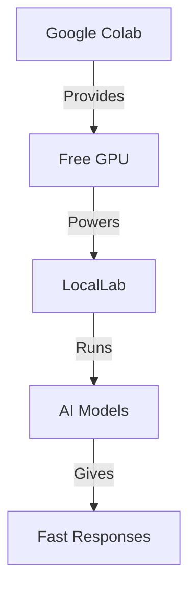

# 🎮 Using LocalLab with Google Colab

Run powerful AI models for free using Google Colab's GPU! This guide will help you get started.

## 🚀 Quick Start

[](https://colab.research.google.com/github/UtkarshTheDev/LocalLab/blob/main/docs/colab/locallab_colab_guide.ipynb)

Our interactive notebook provides everything you need:

- Step-by-step setup
- Ready-to-use examples
- Performance optimization
- Real-time monitoring

## 🎯 Why Use Colab?



### ✨ Benefits

- 🆓 Free GPU access
- ☁️ No local installation needed
- 🚀 Faster processing
- 💾 More memory available
- 📊 Built-in monitoring

## 🔧 Setup Steps

### Part 1: Setting Up the Server

1.  **Get Required Tokens**

    ```python
    # Get these ready:
    NGROK_TOKEN = "..."  # from ngrok.com (for remote access)
    HF_TOKEN = "..."     # from huggingface.co (optional)
    ```

2.  **Install LocalLab Server Package**

    ```python
    !pip install locallab
    ```

3.  **Configure Environment**

    #### Method 1: Using CLI (recommended)

    ```python
    !locallab config  # Enable Ngrok and Hugging face and provide tokens.
    ```

    #### OR Method 2: Using Environment Variables

    ```python
    import os
    os.environ["NGROK_AUTH_TOKEN"] = NGROK_TOKEN
    os.environ["HUGGINGFACE_TOKEN"] = HF_TOKEN # Optional
    ```

4.  **Start Server with Ngrok for Remote Access**

```python
# Method 1: Using CLI (recommended)
!locallab start --use-ngrok

# OR Method 2: Using Python Package
from locallab import start_server
start_server(use_ngrok=True)

# The server will display a public URL like:
# 🚀 Ngrok Public URL: https://abc123.ngrok.app
# COPY THIS URL - you'll need it to connect!
```

### Part 2: Connecting with the Client

After setting up your server, you need to connect to it using the LocalLab client package. This is how your code will interact with the AI models running on the server.

5. **Install LocalLab Client Package**

   ```python
   !pip install locallab-client
   ```

6. **Connect to Your Server**

   ```python
   # Import the client library
   from locallab_client import SyncLocalLabClient  # Synchronous client
   # OR
   from locallab_client import LocalLabClient      # Asynchronous client

   # Connect to your server using the ngrok URL
   client = SyncLocalLabClient("https://abc123.ngrok.app")  # ← REPLACE THIS with your URL!

   # Now you can use the client to interact with your AI model
   # See the Client Connection & Usage Examples below
   ```

> 💡 **Important**: The client can be run from anywhere - another cell in the same notebook, your local computer, or any device with Python and internet access! Always use the ngrok URL that was displayed when you started the server.

## 💡 Client Connection & Usage Examples

Once you have your client connected to the server, you can use it to interact with your AI model. Here are some examples:

### Synchronous Client Examples (Easier for Beginners)

```python
# Make sure you've created a client connection first:
from locallab_client import SyncLocalLabClient
client = SyncLocalLabClient("https://abc123.ngrok.app")  # Your ngrok URL

try:
    # Basic text generation
    response = client.generate(
        "Write a story about a robot",
        temperature=0.7
    )
    print(response)

    # Chat completion
    response = client.chat([
        {"role": "system", "content": "You are helpful."},
        {"role": "user", "content": "Hello!"}
    ])
    print(response.choices[0].message.content)

    # Streaming response
    for token in client.stream_generate("Tell me a story"):
        print(token, end="", flush=True)

finally:
    # Always close the client when done
    client.close()
```

### Asynchronous Client Examples (For Advanced Users)

```python
import asyncio
from locallab_client import LocalLabClient

async def main():
    # Create async client
    client = LocalLabClient("https://abc123.ngrok.app")  # Your ngrok URL

    try:
        # Basic text generation
        response = await client.generate(
            "Write a story about a robot",
            temperature=0.7
        )
        print(response)

        # Chat completion
        response = await client.chat([
            {"role": "system", "content": "You are helpful."},
            {"role": "user", "content": "Hello!"}
        ])
        print(response.choices[0].message.content)

        # Streaming response
        async for token in client.stream_generate("Tell me a story"):
            print(token, end="", flush=True)

    finally:
        # Always close the client when done
        await client.close()

# Run the async function
asyncio.run(main())
```

## 🔍 Troubleshooting

### Common Issues

1. **Connection Error**

   ```python
   # Make sure ngrok token is set
   os.environ["NGROK_AUTH_TOKEN"] = "your_token"
   ```

2. **Out of Memory**

   ```python
   # Enable optimizations
   os.environ["LOCALLAB_ENABLE_QUANTIZATION"] = "true"
   os.environ["LOCALLAB_QUANTIZATION_TYPE"] = "int8"
   ```

3. **Model Loading Error**
   ```python
   # Use a smaller model
   os.environ["HUGGINGFACE_MODEL"] = "microsoft/phi-2"
   ```

## 📚 Additional Resources

- [Interactive Guide](./locallab_colab_guide.ipynb)
- [Troubleshooting](./troubleshooting.md)
- [FAQ](./faq.md)
- [Performance Tips](../features/performance.md)

## 🆘 Need Help?

- Check our [Troubleshooting Guide](./troubleshooting.md)
- Visit our [FAQ](./faq.md)
- Open an [Issue](https://github.com/UtkarshTheDev/LocalLab/issues)
