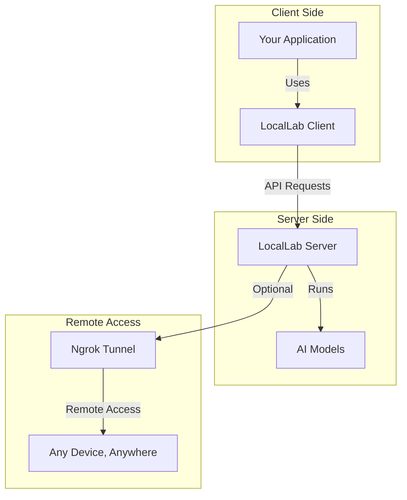

# LocalLab Features Guide

## 📚 Table of Contents

1. [Model Management](./models.md)
2. [Performance Optimization](./performance.md)
3. [Remote Access & Ngrok](./models.md#remote-access-with-ngrok)

## Key Features

### Model Management

- Multiple model support
- Dynamic loading
- Automatic fallback
- Resource-based selection

### Performance Features

- Memory optimization
- Speed optimization
- Resource monitoring
- Batch processing

### Remote Access Features

- **Ngrok Integration**: Access your models from anywhere
- **Secure Tunneling**: Share your models securely
- **Cross-Device Access**: Use from mobile, tablet, or any computer
- **Team Collaboration**: Share model access with teammates
- **Public URL**: Get a public URL for your local server

## Client-Server Architecture

## Related Documentation

- [Getting Started](../guides/getting-started.md)
- [API Reference](../guides/API.md)
- [Local Deployment](../deployment/local.md)
- [Google Colab Guide](../colab/README.md)
